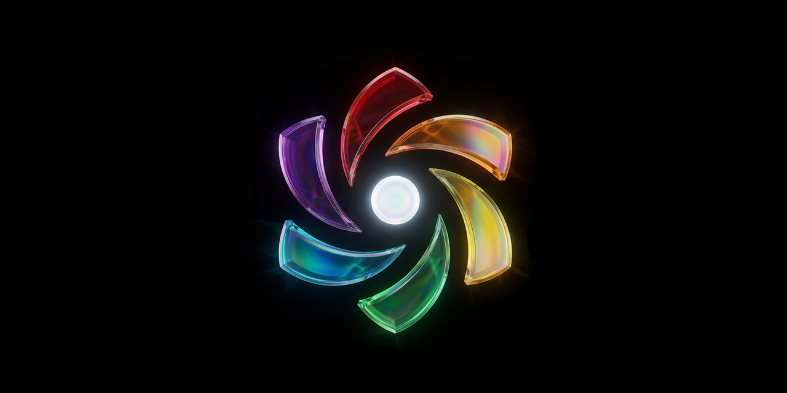

<p align="center">
  
</p>

> **[Omnidea](https://github.com/omnideaco/omnidea)** · For AI-assisted development, see [CLAUDE.md](CLAUDE.md).

# Omnidea

[](LICENSE.md) [](https://github.com/omnideaco/omnidea/stargazers) [](https://github.com/omnideaco/covenant)

A sovereign internet. Own protocol. Own browser. Own identity, encryption, governance, and economics -- built from first principles, governed by a constitution.

Omnidea includes 26 building blocks (A through Z) that handle everything from identity to encryption to commerce to rendering. The protocol layer is finished. The browser is under active development. The Covenant is the project's governing framework.

Think of it as building Chrome, the web, DNS, and payments from scratch -- then binding the whole thing to a bill of rights.

---

## What's Here

This repository wires together four submodules:

| Submodule | What It Is | Language | Status |
|-----------|-----------|----------|--------|
| [Omninet](https://github.com/omnideaco/omninet) | The protocol. 29 Rust crates, 26 building blocks (A-Z), 6,619 tests. | Rust | Complete |
| [Ore](https://github.com/omnideaco/ore) | The engine. Beryllium (Servo fork), Crystal (WebGPU glass), `@omnidea/net` SDK (859 ops), `@omnidea/ui` (40 Solid.js components), `@omnidea/editor` (CRDT). | Rust, TypeScript, WGSL | Active |
| [Omny](https://github.com/omnideaco/omny) | The browser. Omnishell (window shell), omnidaemon (node service), omnidash (chrome), omnigrams (Solid.js programs). | Rust, TypeScript | Active |
| [Covenant](https://github.com/omnideaco/covenant) | The constitution. 14 documents defining Dignity, Sovereignty, and Consent. | Prose | Ratified |

---

## Quick Start

```bash
git clone --recursive https://github.com/omnideaco/omnidea.git
cd omnidea
./build.sh
```

Requirements: Rust (cargo), Node.js (npm), and a working C toolchain.

---

## Architecture

The system is one pipe from protocol to pixels:

```
Rust crates (29)          -- the protocol: identity, encryption, storage, networking, governance
      |
  C FFI (1,040 functions) -- the boundary: Rust exports C-ABI functions
      |
  omnidaemon              -- the daemon: single source of truth, owns all state
      |
  IPC (JSON over unix socket) -- the bridge: daemon talks to frontends
      |
  @omnidea/net (860 ops)  -- the SDK: TypeScript bindings for every daemon operation
      |
  Solid.js + UnoCSS       -- the UI: omnigrams (programs) rendered in the browser shell
```

Omninet is the protocol. Ore is the engine. Omny is the browser. The Covenant governs all three.

---

## The ABCs

26 building blocks, one per letter.

| | Name | Purpose |
|---|---|---|
| A | Advisor | AI cognition |
| B | Bulwark | Safety and protection |
| C | Crown | Identity and self |
| D | Divinity | Platform interface (FFI + rendering) |
| E | Equipment | Communication (Pact protocol) |
| F | Fortune | Economics |
| G | Globe | Networking (ORP) |
| H | Hall | File I/O |
| I | Ideas | Universal content format (.idea) |
| J | Jail | Verification and accountability |
| K | Kingdom | Community governance |
| L | Lingo | Language and translation |
| M | Magic | Rendering and code translation |
| N | Nexus | Federation and interop |
| O | Oracle | Guidance and onboarding |
| P | Polity | Rights enforcement and consensus |
| Q | Quest | Gamification and progression |
| R | Regalia | Design language |
| S | Sentinal | Encryption |
| T | Target | Cargo build output |
| U | Undercroft | System health and observatory |
| V | Vault | Encrypted storage |
| W | World | Digital and physical worlds |
| X | X | Shared utilities |
| Y | Yoke | History and provenance |
| Z | Zeitgeist | Discovery and culture |

---

## Status

**Protocol:** Complete. 29 Rust crates, 6,619 tests passing, 1,040 FFI functions.

**Engine:** Beryllium (Servo fork) rendering web content. Crystal providing WebGPU glass effects. SDK and UI libraries stable.

**Browser:** Under active development. Window lifecycle, identity flows, content rendering, and program hosting are the current focus.

**This is alpha software.** It builds, it runs, it passes its tests -- but it is not yet ready for production use.

---

## The Covenant

Every technical decision answers to three principles:

1. **Dignity** -- worth that cannot be taken, traded, or measured.
2. **Sovereignty** -- the right to choose, refuse, and reshape.
3. **Consent** -- voluntary, informed, continuous, and revocable.

The Covenant is the project's governing framework. See the [Covenant](https://github.com/omnideaco/covenant) for the full text.

---

## License

AGPL-3.0, governed by the Covenant. See [LICENSE.md](https://github.com/omnideaco/omninet/blob/main/LICENSE.md).

The code is free to use, modify, and distribute. The one binding condition: alignment with Dignity, Sovereignty, and Consent.

---

## Contributing

See [CONTRIBUTING.md](CONTRIBUTING.md) for build instructions, code style, and how to submit changes. For cross-repo integration details, see [WIRING.md](WIRING.md).
